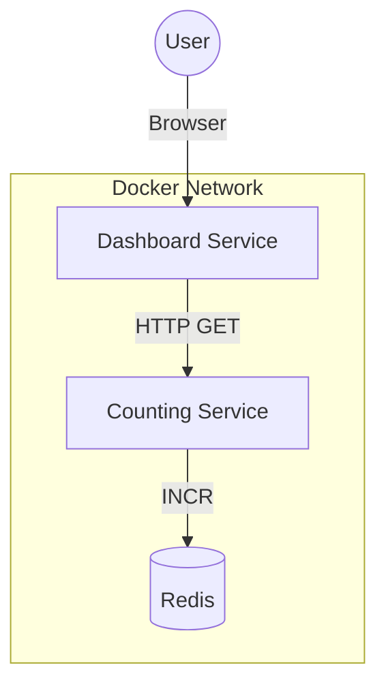

# Dashboard-Counting

This repository contains a demonstration of a microservices architecture using Consul for service discovery. It consists of two main services: `counting-service` and `dashboard-service`.

## Services

### Counting Service
A backend service written in Go regarding counting logic.
- **Port**: 9001 (default)
- **Path**: `/counting-service`

### Dashboard Service
A frontend service that displays the count from the counting service.
- **Port**: 80 (default)
- **Path**: `/dashboard-service`

### Redis Service
A Redis instance that stores the count state.
- **Port**: 6379
- **Persistence**: Disabled (count resets on restart) for demo purposes.

## Architecture

The system uses a Service-to-Service pattern where the Dashboard Service communicates with the Counting Service, which in turn persists data to Redis.

**Features:**
- **Graceful Degradation**: If Redis is unavailable, the Counting Service returns a fallback response, and the Dashboard displays a visual error banner.
- **Observability**: The Dashboard displays the hostname of the backend container and the unique Run ID of the Redis instance.



## Local Development

### Prerequisites
- Go 1.22+
- Docker

### Running Locally
To run the services locally:

1. **Counting Service**:
    ```bash
    cd counting-service
    go run main.go
    ```

2. **Dashboard Service**:
    ```bash
    cd dashboard-service
    go run main.go
    ```

## Docker

You can build and run the services using Docker. Each service has its own `Dockerfile`.

### Building Images

```bash
# Counting Service
docker build -t counting-service ./counting-service

# Dashboard Service
docker build -t dashboard-service ./dashboard-service
```

### Running Containers

You can run the containers individually using `docker run`:

```bash
docker run -p 9001:9001 winyannainghtut/counting-service:latest
docker run -p 8080:80 winyannainghtut/dashboard-service:latest
```

### Docker Compose

Alternatively, you can run both services together using Docker Compose.

**Note:** You must pull the Docker images locally before running the services.

```bash
# Pull the images
docker pull winyannainghtut/counting-service:latest
docker pull winyannainghtut/dashboard-service:latest

# Run the services (and build local changes)
docker-compose up --build
```

## Testing Scenarios

You can verify the system's robustness by forcing failures:

### 1. Redis Failure (Graceful Degradation)
**Scenario**: Stop Redis but keep other services running.
```bash
docker stop demo-consul-101-redis-counting-1
```
**Expected Result**:
- Dashboard: Shows a red error banner (e.g., "Redis Error: ...").
- Count: Shows "!" or error state.
- **Critical**: The "Counting Service" hostname card **still displays a valid ID**. This proves the backend service is alive and handling the error gracefully.
- Redis Run ID: Shows "Unknown".

**Resume**:
```bash
docker start demo-consul-101-redis-counting-1
```
**Expected Result**: Application recovers automatically. Error banner disappears, and count resumes.

### 2. Counting Service Failure
**Scenario**: Stop the backend service.
```bash
docker stop demo-consul-101-counting-service-1
```
**Expected Result**:
- Dashboard: Shows "Counting Service is Unreachable" in the status badge.
- **Resilience**: The **Dashboard Hostname** card remains visible and valid, proving the frontend service is functioning.
- Count/Backend Info: Shows error or "Waiting...".

### 3. Data Persistence Test
**Scenario**: Verify if data survives a restart.
1. Increment the count a few times.
2. Restart the stack: `docker-compose restart`
3. Check if count continues or resets to 1.

**Configuration**:
- **Ephemeral (Current Default)**: Count **resets to 1**.
  configured in `docker-compose.yml`:
  ```yaml
  command: redis-server --save "" --appendonly no
  ```
- **Persistent**: Count **continues**.
  To enable, remove the `command` line in `docker-compose.yml` and restart (`docker-compose up --build --force-recreate`).

## CI/CD Pipeline

The project uses GitHub Actions for Continuous Integration and Deployment. 

- **Workflow**: `.github/workflows/ci-cd.yml`
- **Trigger**: Pushes and Pull Requests to the `main` branch.
- **Actions**:
    - Builds Docker images for both services in parallel.
    - Pushes images to Docker Hub using secrets `DOCKER_USERNAME` and `DOCKER_PASSWORD`.

To view the workflow runs, navigate to the **Actions** tab in the GitHub repository.
